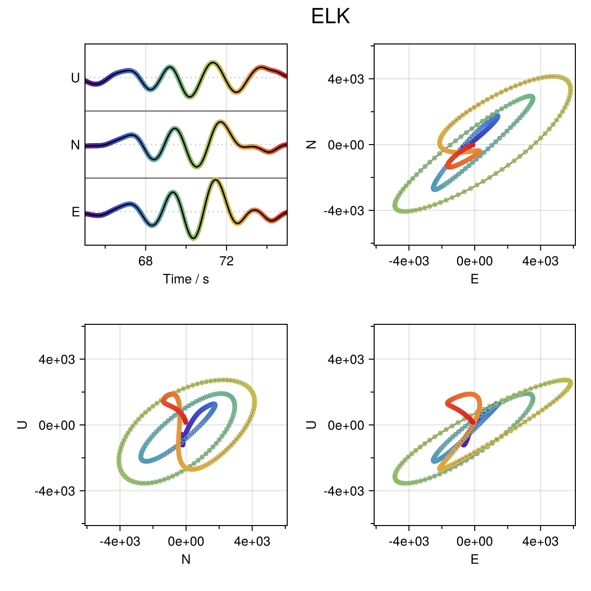

# Seis_utils

## visualization

- hodograms_3comp.jl
  - Plotting particle motions of three-component waveforms in a single figure.

## io

- jma_to_csv.jl
  - Convert JMA's hypocenter list to csv file.
